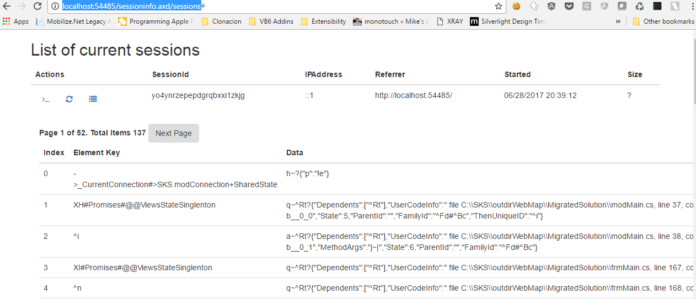
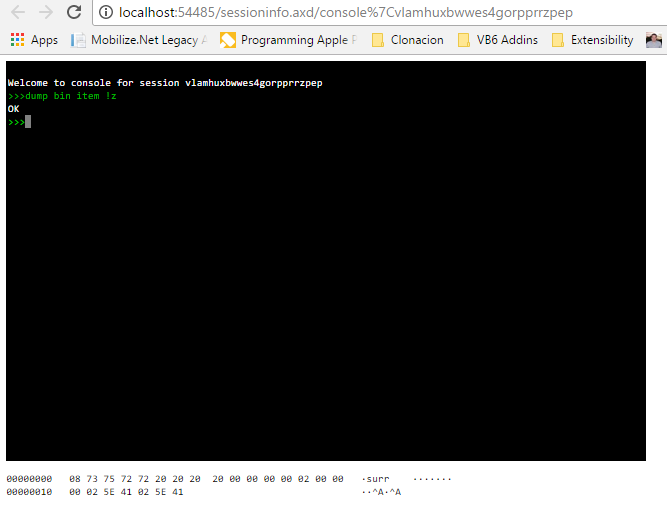

Online Users Module Version 2.0
================================

This is a simple module that you can add to your website to monitor current users and session sizes

I created this module mostly to deal with ASP.NET MVC Applications specially applications migrated with Mobilize.NET WebMap.

Recently I realized that the Github code was not compiling, so I decided to update it a little and provide some more features.

Features in this release
------------------------

My focus in this release was mostly on make it simple to use.
On previous versions there were some manual steps to use it (don't you hate that!!)
So in this new version, I hope it is super simple. 

```
Install-Package OnlineUsersModule
```

And that's all ( Well in most cases).

NOTE: I assume that you have an ignore route like: `routes.IgnoreRoute("sessioninfo.axd/{*pathInfo}");`
inside your `RouteConfig.cs`.

But what does this nuget do?
---------------------------

Well it add an easy way to see the current list of sessions. 
So for example if you  application is running at `http:\\localhost:54485' then
just navigate to `http://localhost:54485/sessioninfo.axd/sessions` it would show a list like:



From the session screen you can query the current session size, list the session contents or open the 
session terminal.

What is the session terminal?
---------------------------
	
Well in this version I added a session console. I just wanted to create a terminal-like interface
and terminal interfaces are cool.



This terminal only implements some simple commands:

```
>> dump session
```

This command will create an Excel file with the session contents. Very handy to perform analysis and comparisons.

```
>> dump item ITEMID
```

This command shows the content of a the item with a particular id in the session

```
>> dump pattern REGULAREXPRESSION
```

This command shows the contents of all elements that match the given regular expression

```
>> dump bim ITEMID
```

Shows a hex dump of the item with a particular id in the session

